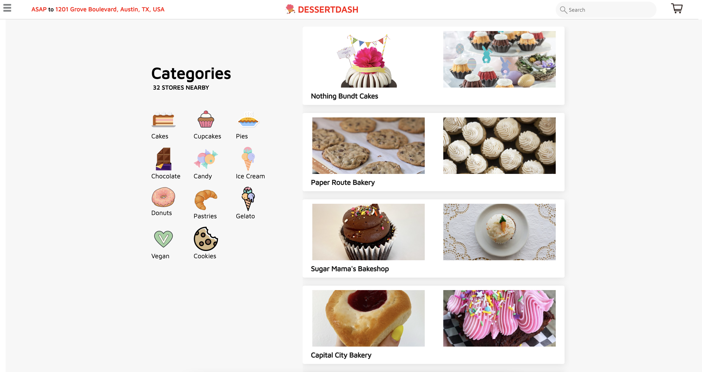

<br />
<p align="center">
  <a href="https://github.com/laurenchambers/DessertDash">
    
  </a>

  <h3 align="center">DessertDash</h3>

  <p align="center">
    DessertDash is a dessert-lover's paradise website based on the popular food delivery app DoorDash. Users can view local desserts, add the item(s) to their cart, and have them delivered straight to their door!
     <br />
  <br />
    <a href="https://github.com/laurenchambers/dessertdash/wiki"><strong>Explore the docs »</strong></a>
    <br />
    <br />
    <a href="https://dessertdash.herokuapp.com/">View Site</a>
  </p>
</p>


<!-- TABLE OF CONTENTS -->
<details open="open">
  <summary><h2 style="display: inline-block">Table of Contents</h2></summary>
  <ol>
    <li>
      <a href="#about-the-project">About The Project</a>
      <ul>
        <li><a href="#built-with">Built With</a></li>
      </ul>
    </li>
    <li>
      <a href="#getting-started">Getting Started</a>
      <ul>
        <li><a href="#prerequisites">Prerequisites</a></li>
        <li><a href="#installation">Installation</a></li>
      </ul>
    </li>
    <li><a href="#roadmap">Roadmap</a></li>
    <li><a href="#contributing">Contributing</a></li>
  </ol>
</details>

<!-- ABOUT THE PROJECT -->
## About The Project
[Click here to view DessertDash live on the web!](https://dessertdash.herokuapp.com/)
<br>
 
   
  
</br>


### Built With

* [JavaScript]()
* [Python]()
* [React]()
* [Redux]()
* [Flask]()
* [SQLAlchemy]()
* [Docker]()
* [CSS]()


<!-- GETTING STARTED -->
## Getting Started

To get a local copy up and running follow these simple steps.

### Prerequisites

Here is everything we need you to do to get started with DessertDash.

  * npm
  ```sh
  npm install npm@latest -g
  ```
  * pipenv
  ```
  pipenv install
  ```

### Installation

1. Clone the repo
   ```sh
   git clone https://github.com/tedjanton/Brewd
   ```
2. Install NPM packages in the React App
   ```sh
   npm install
   ```
3. Install Dependencies
   ```bash
   pipenv install --dev -r dev-requirements.txt && pipenv install -r requirements.txt
   ```

4. Add a '.env' with your environment variables to the root of your local directory

5. Create a postgreSQL user
    ```sh
    CREATE USERS <<your username>> WITH PASSWORD <<your password>> CREATEDB
    ```
6. Create your database
    ```sh
   CREATE DATABASE <<database name>> WITH OWNER <<your username>>
    ```
7. Start a pipenv virtual environment
   ```bash
   pipenv shell
   ```
8. Migrate and seed your database
    ```sh
    flask db migrate
    ```
    ```bash
   flask db upgrade
   ```
   ```bash
   flask seed all
   ```
   ```bash
   flask run
   ```
9. Start your local development server in the React App
   ```bash
   npm start
   ```


<!-- ROADMAP -->
## Roadmap

See the [open issues](https://github.com/laurenchambers/DessertDash/issues) for a list of proposed features (and known issues).


<!-- CONTRIBUTING -->
## Contributing

Contributions are what make the open source community such an amazing place to be learn, inspire, and create. Any contributions you make are **greatly appreciated**.

1. Fork the Project
2. Create your Feature Branch (`git checkout -b feature/AmazingFeature`)
3. Commit your Changes (`git commit -m 'Add some AmazingFeature'`)
4. Push to the Branch (`git push origin feature/AmazingFeature`)
5. Open a Pull Request

